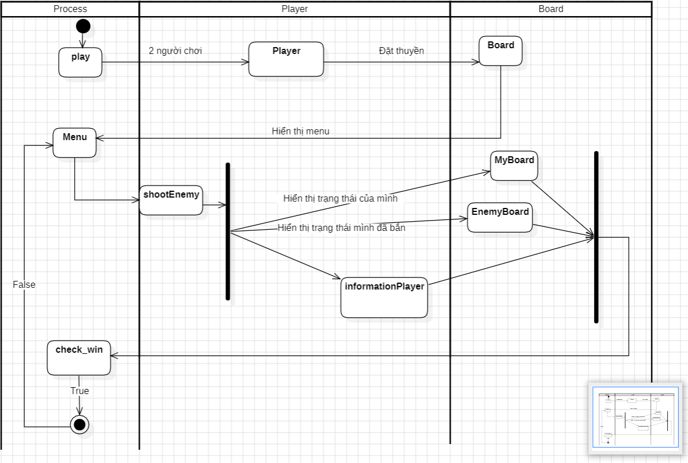

# Ý tưởng

# Trong đó: 
+ Lớp Board: 
    - gồm 2 List là MyBoard và EnemyBoard
    - Board() : phương thức khởi tạo làm công việc khởi tạo
    - MyBoard(): phương thức hiện thị bảng của bản thân
    - EnemyBoard(): phương thức hiện thị bảng đạn mình đã bắn

+ Lớp Player kế thừa Board để lấy 2 bảng
    - Player(): phương thức khởi tạo làm công việc
        1. Xác định tên người chơi
        2. Xác định tọa độ 5 thuyền muốn đặt + hiển thị bảng của bản thân
    - shootEnemy(): phương thức xác dịnh tọa độ mình định bắn
    - informationPlayer(): phương thức hiển thị
        1. Bảng của đối phương dạng sương mù
        2. Số đạn đã bắn
        3. Số tàu đã bị phá của địch
        4. Số tàu còn lại của mình
+ Lớp Process:
    - play(): phương thức bao gồm
        + 2 Player(): người chơi 1,2
        + Menu
        + Lượt bắn + tọa độ bắn
        + thông tin sau mỗi lần bắn
        + check_win()
